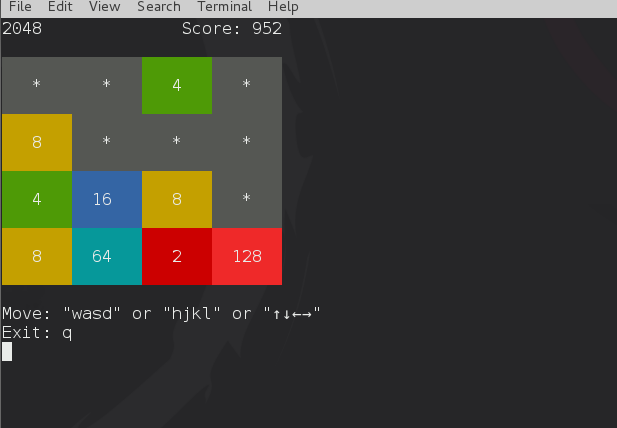

hs-2048
=======

Small 2048 game written in haskell (Linux terminal version). 
About 2048: [wiki-2048](https://en.wikipedia.org/wiki/2048_%28video_game%29)




Install dependencies (If have done, please ignore.)
----------

```
$ cabal install random
$ cabal install ansi-terminal
```

Run (under linux bash)
---------

```
ghc 2048.hs
./2048
```

or

```
ghci 2048.hs
```

or

```
cabal exec ghc 2048.hs
```

TODO
--------

- Add solution

License
--------

GNU GPL v3, <http://www.gnu.org/licenses/>

