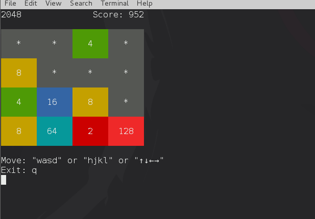

hs-2048
=======

Small 2048 game written in haskell (Linux terminal version).
About 2048: [wiki-2048](https://en.wikipedia.org/wiki/2048_%28video_game%29)



#### Requirements

You may need `GHC 8.X` and `cabal` installed on your system. If you are running Debian stretch, you just need the following command:

```
# apt-get install ghc cabal-install
```

#### Run (under linux bash)

```bash
cd hs-2048
cabal sandbox init

# install dependencies
cabal install --only-dependencies

# build
cabal build

# run
cabal run
```

#### License

GNU GPL v3, <http://www.gnu.org/licenses/>
